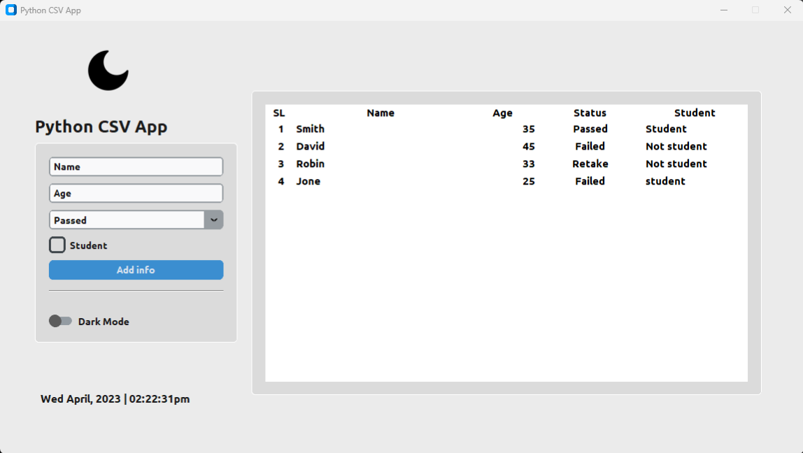
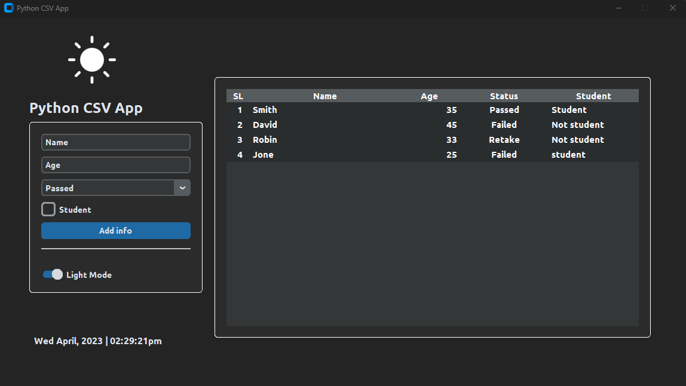

# CTk CSV App

### A Modern Student Information Manager Built with CustomTkinter & CSV

**CTk CSV App** is a lightweight, cross-platform desktop application built using **Python** and **CustomTkinter**.  
It provides a simple, modern interface for managing student information and storing data in **CSV files**—keeping the workflow clean, fast and portable.

This app includes quality-of-life features such as a **real-time digital clock** and **theme mode switching**, delivering a polished and user-friendly experience.


## Technologies Used

### **Tkinter**
Tkinter is Python’s standard GUI library used for building cross-platform desktop applications.

### **CustomTkinter**
[CustomTkinter](https://github.com/TomSchimansky/CustomTkinter) extends Tkinter with:

- Modern, consistent design  
- Light & Dark themes  
- High-DPI scaling  
- Fully customizable modern widgets  

Together, they ensure a smooth UI experience on **Windows**, **macOS** and **Linux**.


## Features

- Add & store student information in CSV format  
- Modern CustomTkinter interface  
- Real-time digital clock  
- Light/Dark mode switching  
- Icon-based theme toggle  
- Cross-platform compatibility  
- Beginner-friendly codebase  


## Development Environment

This project was developed using:

- **Operating Systems:**  
  - Windows 11  
  - Kali Linux 2025.2  

- **Software:**  
  - Python 3.11  
  - Visual Studio Code  


## Installation

### 1. Install Python  
Download and install Python from:  
https://www.python.org/downloads/

Make sure `pip` is available in your system PATH.

### 2. Install Project Requirements

Use the `requirements.txt` file to install dependencies:

```bash
pip install -r requirements.txt
# or (Linux/macOS)
sudo pip install -r requirements.txt
```


## Project Structure
Here’s the structure of the **CTk CSV App** project:

```bash
CTk-CSV-App/
│
│── screenshots/
│── main.py
│── LICENSE
├── README.md
└── requirements.txt
```


## Run the Application
```bash
python main.py
```


## Screenshots

Here are some screenshots of the `CTk CSV App` project:

**Application with Light Mode**<br/>
<br/>
**Application with Dark Mode**<br/>
<br/>


## Contributing

Contributions, suggestions, and feedback are always welcome! ❤️<br/>
To contribute:

1. Fork the repository
2. Create a new branch (`feature/new-feature`)
3. Commit your changes
4. Push and submit a Pull Request

💬 You can also open an issue if you’d like to discuss a feature or report a bug.


## For more or connect with me

<p align='center'>
  <a href="https://github.com/iamx-ariful-islam"></a>&nbsp;&nbsp;&nbsp;&nbsp;
  <a href="https://x.com/mx_ariful_islam"></a>&nbsp;&nbsp;&nbsp;&nbsp;
  <a href="https://bd.linkedin.com/in/iamx-ariful-islam"></a>&nbsp;&nbsp;&nbsp;&nbsp;
  <a href="https://www.facebook.com/jonakisoft.net/"></a>&nbsp;&nbsp;&nbsp;&nbsp;
</p>


## License

The [MIT](https://choosealicense.com/licenses/mit/) License (MIT)


## Thank You for Visiting!

> “Good design is about making things simple yet significant”  
> — *Md. Ariful Islam*